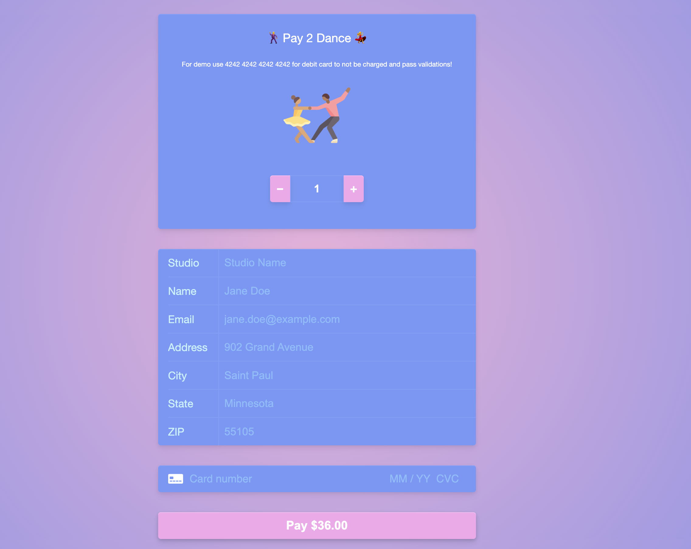
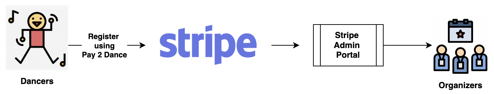

# 🕺 Pay 2 Dance! 💃

**Pay 2 Dance** is a progressive web app payment platform for ballroom championships!

Demo app can be found [here](https://www.pay2.dance)



## Inspiration

Ballroom dance championships opens are super fun, but to host a dance championships is a lot of work! Dancers affiliated with studios need to register but right now there's not a good payment vendor or software solution to do registrations online.

**Pay 2 Dance** attempts to solve that problem by using [Stripe](https://stripe.com/) as a payment vendor that allows you to accept debit card, credit cards, amex all at a flat **2.9% plus 30 cents**

It also will send an email receipt to the dancers email address for record.

All the information is stored in secured way through Stripe!

On the stripe admin dashboard, you should be able to see all the registration details.

## Configuring Stripe

Note: The author of **Pay 2 Dance** is not affiliated with Stripe!

Go here to register for [stripe](https://dashboard.stripe.com/)
You will need the `PUBLISHABLE_KEY` and `SECRET_KEY` to add to root directory as .env folder.

I would use the following format for your .env file!

```
# More info: https://nextjs.org/docs/basic-features/environment-variables#exposing-environment-variables-to-the-browser

PUBLISHABLE_KEY=pk_test**********
SECRET_KEY=sk_test********
```

## Registration Flow



## Is this [PCI Compliant](https://en.wikipedia.org/wiki/Payment_Card_Industry_Data_Security_Standard) ?

Absolutely! 

The website is hosted on a secure channel and payment information is not stored anywhere except for the Stripe hosted input box that millions of users use and trust all around the world. Stripe's standard security practices can be found [here](https://stripe.com/docs/security/stripe)!

## Price

**Absolutely free!**

The technologies (frameworks i.e. nextJS) used to write the code is completely open source.
Github Pages is used to host the app which is also completely free.
You only pay a payment processing fee when payment is going through Stripe's secure channel.

## Scripts

Run this to install all the dependencies

```bash
npm install
```

Run this to run the app locally on a dev server

```bash
npm run dev
```

Run this to generate a production build of the app generated at the `docs` directory

```bash
npm run deploy
```

### Disclaimer

The words of which the initial letter is capitalized have meanings defined under the following conditions. The following definitions shall have the same meaning regardless of whether they appear in singular or in plural.

For the purposes of this Disclaimer:

- Company (referred to as either "the Company", "We", "Us" or "Our" in this Disclaimer) refers to the **Pay 2 Dance** app author.
- Service refers to the Website.
- You means the individual accessing the Service, or the company, or other legal entity on behalf of which such individual is accessing or using the Service, as applicable.
  Website refers to Pay 2 Dance, accessible from http://www.pay2.dance

The information contained on the Service is for general information purposes only.
The Company assumes no responsibility for errors or omissions in the contents of the Service.
In no event shall the Company be liable for any special, direct, indirect, consequential, or incidental damages or any damages whatsoever, whether in an action of contract, negligence or other tort, arising out of or in connection with the use of the Service or the contents of the Service. The Company reserves the right to make additions, deletions, or modifications to the contents on the Service at any time without prior notice. This Disclaimer has been created with the help of the TermsFeed Disclaimer Generator.
The Company does not warrant that the Service is free of viruses or other harmful components.
The Service may contain links to external websites that are not provided or maintained by or in any way affiliated with the Company.
Please note that the Company does not guarantee the accuracy, relevance, timeliness, or completeness of any information on these external websites.
The information given by the Service is for general guidance on matters of interest only. Even if the Company takes every precaution to insure that the content of the Service is both current and accurate, errors can occur. Plus, given the changing nature of laws, rules and regulations, there may be delays, omissions or inaccuracies in the information contained on the Service.
The Company is not responsible for any errors or omissions, or for the results obtained from the use of this information.
The Company may use copyrighted material which has not always been specifically authorized by the copyright owner. The Company is making such material available for criticism, comment, news reporting, teaching, scholarship, or research.
The Company believes this constitutes a "fair use" of any such copyrighted material as provided for in section 107 of the United States Copyright law.
If You wish to use copyrighted material from the Service for your own purposes that go beyond fair use, You must obtain permission from the copyright owner.
The Service may contain views and opinions which are those of the authors and do not necessarily reflect the official policy or position of any other author, agency, organization, employer or company, including the Company.
Comments published by users are their sole responsibility and the users will take full responsibility, liability and blame for any libel or litigation that results from something written in or as a direct result of something written in a comment. The Company is not liable for any comment published by users and reserves the right to delete any comment for any reason whatsoever.
The information on the Service is provided with the understanding that the Company is not herein engaged in rendering legal, accounting, tax, or other professional advice and services. As such, it should not be used as a substitute for consultation with professional accounting, tax, legal or other competent advisers.
In no event shall the Company or its suppliers be liable for any special, incidental, indirect, or consequential damages whatsoever arising out of or in connection with your access or use or inability to access or use the Service.
All information in the Service is provided "as is", with no guarantee of completeness, accuracy, timeliness or of the results obtained from the use of this information, and without warranty of any kind, express or implied, including, but not limited to warranties of performance, merchantability and fitness for a particular purpose.
The Company will not be liable to You or anyone else for any decision made or action taken in reliance on the information given by the Service or for any consequential, special or similar damages, even if advised of the possibility of such damages.
